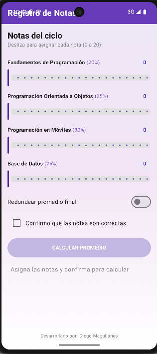
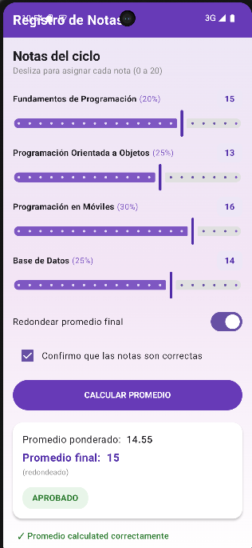

# Laboratorio 03: Registro de Notas

**Alumno:** Diego Magallanes  
**Curso:** Programación en Móviles

## Descripción
Aplicación en Jetpack Compose que gestiona las notas del ciclo con `Slider`, `Switch` y `Checkbox` siguiendo el patrón de estado y cálculo ponderado.

## Evidencia de Funcionamiento
- **Estado Inicial:** 
- **Promedio Calculado:** 