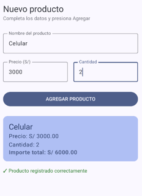
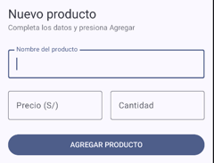
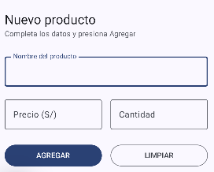
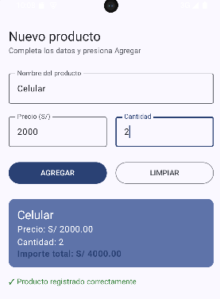
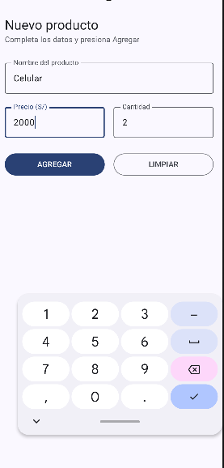

# Laboratorio 03: Registro de Producto

**Alumno:** Diego Magallanes  
**Curso:** Programación en Móviles

## Descripción
Aplicación construida en Jetpack Compose para registrar un producto calculando su importe total con dos decimales mediante gestión de estados.

## Capturas de Pantalla
- Formulario Vacío: 
- Producto Registrado: 

## Pregunta de Reflexión
**¿Qué pasaría si declaras las variables de los campos SIN `remember`?**
Si se declaran las variables sin `remember`, cada vez que el usuario escribe un carácter se desencadena una recomposición en Compose. Al recomponer la pantalla sin `remember`, las variables se reinician al valor por defecto `""`, lo que provoca que el texto ingresado se borre de inmediato y no se mantenga el estado.
## Parte B: Mejora con IA

### Proceso de desarrollo asistido

| Prompt que usé | Qué generó la IA | Qué corregí o ajusté |
| :--- | :--- | :--- |
| "Modifica PantallaRegistro para agregar validación de campos vacíos y un botón LIMPIAR con Material 3." | Generó las variables de estado, la validación de campos y el botón LIMPIAR. | Agregué `keyboardOptions` con `KeyboardType.Number` en Precio y Cantidad para forzar el despliegue del teclado numérico. |
### Capturas del sistema funcionando:

